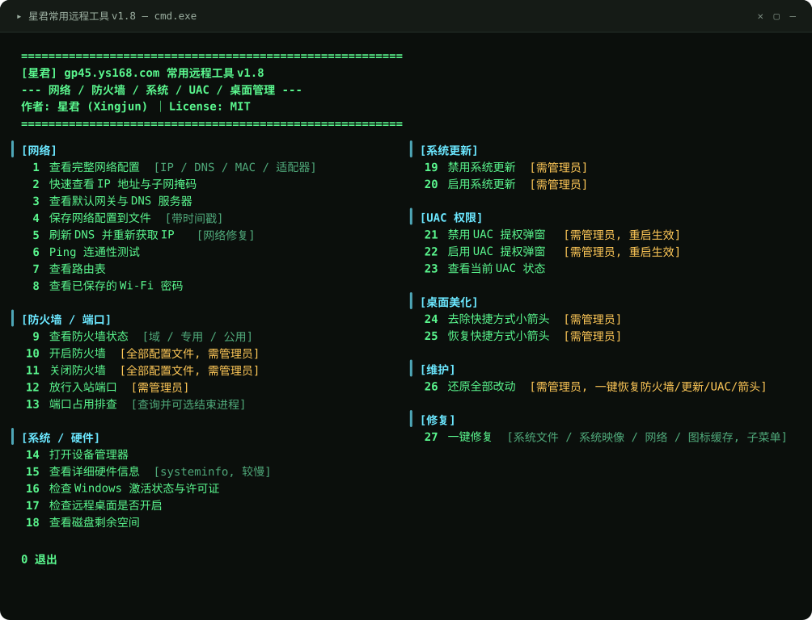

<div align="center">

# 星君常用远程工具

**一个单文件的 Windows 批处理菜单工具，把远程协助时最常用的排查动作收进一个编号菜单。**

敲个数字就能跑，不用记命令。

[](LICENSE)
[](#兼容性)
[](https://github.com/reroc8/xingjun-remote-toolkit/releases/latest)
[](https://github.com/reroc8/xingjun-remote-toolkit/releases)
[](https://github.com/reroc8/xingjun-remote-toolkit/actions/workflows/test.yml)

[下载](#下载) · [使用方法](#使用方法) · [功能一览](#功能一览) · [改动与还原](#改动与还原) · [注意事项](#注意事项) · [已知限制](#已知限制) · [常见问题](#常见问题) · [开发与测试](#开发与测试)

</div>



> 上图就是程序的实际输出：**两列**、`color 0A` 的黑底浅绿字，内容逐字一致。
> 唯一和你屏幕上不同的是**字体** —— 图里用的是接近 cmd 的等宽字体，
> 你实际看到的取决于自己 cmd 的字体设置（中文系统默认一般是新宋体）。

**关于两列**：脚本启动时会用 `mode con` 把窗口设成 **100 列 × 43 行**，否则两列排不下。
如果你把 cmd 字体调得特别大、或者用的是 Windows Terminal 的窄窗口，两列可能会折行 ——
把窗口拉宽或把字体调小即可。

---

## 为什么做这个

日常远程帮人看机器，来来回回就是那几件事：查 IP、查 DNS、看防火墙、放行端口、查端口占用、看看远程桌面开没开。
每次都要回忆命令、翻笔记，效率很低。这个小工具把这些动作做成菜单，敲个数字就能跑。

**不联网、不装东西、不改系统以外的任何东西** —— 全部调用 Windows 自带命令实现，脚本可以直接用记事本打开逐行核对。

---

## 下载

从 [Releases 页面](https://github.com/reroc8/xingjun-remote-toolkit/releases/latest) 下载附件即可，双击运行，无需安装。

| Release 附件 | 仓库内源文件 |
|---|---|
| `XingjunRemoteTool-v1.8.bat` | `星君常用远程工具v1.8.bat` |

> **当前没有已发布的版本。** v1.6 和 v1.7 都已删除（它们都有缺陷，详见 [CHANGELOG](CHANGELOG.md)）。v1.8 已经修好，上面的 Releases 页面发布后即可下载。现在要用的话，直接取仓库里的 `星君常用远程工具v1.8.bat`。

下载后建议校验文件完整性：

```
SHA256  e1c7a0a76367e4d6606f9b3474b7c1f3d18aad532d45e8bef5aa913c559b5118
```

Windows 自带校验命令：

```bat
certutil -hashfile XingjunRemoteTool-v1.8.bat SHA256
```

---

## 使用方法

1. 把 `.bat` 文件放到桌面或任意目录。程序会在**同目录**下自动建一个 `导出` 文件夹，用来放导出的文本报告。
2. 双击运行。程序会**自动弹出 UAC 提权窗口**，点「是」就会以管理员身份重新打开（有 10 项功能需要）。
   点「否」也能继续用，只是需要管理员的功能会提示权限不足。
3. 按菜单提示输入序号后回车。功能执行完会停在结果页，按任意键回到菜单。
4. 输入 `0` 退出。

> 脚本为 GBK 编码，启动时自动切到 `chcp 936`，中文显示正常。
> 在非中文区域的 Windows 上，中文界面可能显示为乱码。

### 哪些功能需要管理员权限

菜单里带 `[需管理员]` 标记的都需要，一共 13 个：**10、11、12、19、20、21、22、24、25、26、27、28、29**。
另外 **功能 5**（刷新 DNS 重获 IP）菜单里没标，但同样需要 —— 因为 `ipconfig /release` 要求提权。

程序启动时会自动请求提权，不用手动右键。

---

## 功能一览

### 网络

| 序号 | 功能 | 说明 |
|:---:|---|---|
| 1 | 查看完整网络配置 | IP / DNS / MAC / 适配器，等价 `ipconfig /all` |
| 2 | 快速查看 IP 与子网掩码 | |
| 3 | 查看默认网关与 DNS 服务器 | |
| 4 | 保存网络配置到文件 | 带时间戳，存到 `导出` 目录 |
| 5 | 刷新 DNS 并重新获取 IP | `flushdns` + `release` + `renew`，网络修复用 · **需管理员** |
| 6 | Ping 连通性测试 | 默认 `www.baidu.com`，可改 |
| 7 | 查看路由表 | 等价 `route print` |
| 8 | 查看已保存的 Wi-Fi 密码 | 输入 SSID 后显示明文密码 |

### 防火墙 / 端口

| 序号 | 功能 | 说明 |
|:---:|---|---|
| 9 | 查看防火墙状态 | 域 / 专用 / 公用三个配置文件 |
| 10 | 开启防火墙 | 全部配置文件 · **需管理员** |
| 11 | 关闭防火墙 | 全部配置文件，会警告对入站不设防 · **需管理员** |
| 12 | 放行入站端口 | 支持 TCP / UDP，规则名 `星君放行_协议_端口` · **需管理员** |
| 13 | 端口占用排查 | 查出占用进程的 PID，确认后可强制结束。**端口范围校验 1-65535** |

### 系统 / 硬件

| 序号 | 功能 | 说明 |
|:---:|---|---|
| 14 | 打开设备管理器 | |
| 15 | 查看详细硬件信息 | `systeminfo`，较慢 |
| 16 | 检查 Windows 激活状态 | 系统版本 + 许可证详情 + 激活状态 |
| 17 | 检查远程桌面是否开启 | 读注册表 `fDenyTSConnections` + 查防火墙规则 |
| 18 | 查看磁盘剩余空间 | 各盘总计 / 剩余 |

### 系统更新

| 序号 | 功能 | 说明 |
|:---:|---|---|
| 19 | 禁用系统更新 | 停用并禁用 `wuauserv` / `bits` / `UsoSvc`，同时禁用两个更新计划任务 · **需管理员** |
| 20 | 启用系统更新 | 上面四样的反向操作 · **需管理员** |

### UAC 权限

| 序号 | 功能 | 说明 |
|:---:|---|---|
| 21 | 禁用 UAC 提权弹窗 | `EnableLUA=0`，重启生效，有副作用 · **需管理员** |
| 22 | 启用 UAC 提权弹窗 | `EnableLUA=1`，重启生效，推荐的安全状态 · **需管理员** |
| 23 | 查看当前 UAC 状态 | |

### 桌面美化

| 序号 | 功能 | 说明 |
|:---:|---|---|
| 24 | 去除快捷方式小箭头 | 把 `Shell Icons\29` 指向一张接近透明的图标（`imageres.dll,197`）+ 重启资源管理器 · **需管理员** |
| 25 | 恢复快捷方式小箭头 | 先检测是否已去除，再删除注册表项并重启资源管理器 · **需管理员** |

### 维护

| 序号 | 功能 | 说明 |
|:---:|---|---|
| 26 | 还原全部改动 | 一键把防火墙 / 系统更新 / UAC / 快捷方式箭头恢复为默认，并删除所有 `星君放行_*` 防火墙规则 · **需管理员** |

### 修复

点 27 进去是一个子菜单，专门处理「对方电脑出问题了」这类场景。全部调用 Windows 自带命令，不联网、不装东西。

| 序号 | 功能 | 说明 |
|:---:|---|---|
| 27 | 一键修复（子菜单） | 入口 · **需管理员** |
| 27-1 | 全部修复 | 下面三项依次跑一遍，约 15-40 分钟 |
| 27-2 | 系统文件检查修复 | `sfc /scannow`，修损坏的系统文件，5-20 分钟 |
| 27-3 | 系统映像修复 | `DISM /Online /Cleanup-Image /RestoreHealth`，10-30 分钟 |
| 27-4 | 网络重置修复 | `netsh winsock reset` + `netsh int ip reset` + 刷新 DNS。**专治「能上 QQ 但打不开网页」**，完成后需重启 |
| 27-5 | 重建图标缓存 | 图标变白 / 错乱时用。**会短暂重启资源管理器**（见下方说明） |

> 2 和 3 很慢，进度会显示在窗口里，别以为卡死了。
> 这些操作都不改你的设置，只是把系统文件和网络栈修回正常状态，不需要"还原"。

#### 为什么工具不替你重建图标缓存

重建缓存必须先**结束资源管理器**，才能删掉被它占用的缓存文件。而结束资源管理器会让桌面和任务栏消失几秒。

本地操作问题不大，但**这个工具是拿来做远程协助的** —— 屏幕一黑，远程连接就断了，你根本没法恢复。

所以 27-5 只给出安全的手动步骤（任务管理器 → Windows 资源管理器 → 右键「重新启动」），**工具自己不动资源管理器**。
同理，功能 24 / 25 改完小箭头后也需要**注销或重启**才生效，而不是由工具替你重启资源管理器。

### 电源 / 锁屏

| 序号 | 功能 | 说明 |
|:---:|---|---|
| 28 | 禁止锁屏与休眠 | 显示器永不关闭、电脑永不睡眠、关闭屏保、唤醒不再要求密码、取消无操作自动锁屏限制 · **需管理员** |
| 29 | 恢复锁屏与休眠默认 | 恢复为 Windows 常见默认值（显示器 10 分钟、睡眠 30 分钟、唤醒要求密码） · **需管理员** |

> 适用：远程协助时不想让对方电脑锁屏、挂机跑任务、长时间看东西。
> 代价是电脑会一直耗电、屏幕常亮，**用完记得用 29 恢复**。
> 如果屏保是被组策略强制的，或者笔记本有厂商自己的省电策略，这里可能改不动。

### 快捷工具

点 30 进去是一个子菜单，把常用的 Windows 管理工具收进来。**远程指导时最省事** —— 不用再让对方「右键此电脑 → 管理 → …」一层层点，你直接报个数字让他敲。

| 按键 | 工具 | 用途 |
|:---:|---|---|
| 1 | 事件查看器 | 看报错、找蓝屏原因 |
| 2 | 系统配置 / 启动项 | 看开机自启，排查开机慢 |
| 3 | 服务 | 看服务状态 |
| 4 | 计算机管理 | 设备 / 磁盘 / 服务 / 事件聚合在一起 |
| 5 | 程序和功能 | 卸载软件 |
| 6 | 网络连接 | 网卡状态、改 IP |
| 7 | 任务管理器 | |
| 8 | 电源选项 | 配合 28 / 29 |
| 9 | 上帝模式 | 集中了几乎所有系统设置，找设置不用到处翻 |

> 打开工具不需要管理员权限。设备管理器是功能 14，这里不重复。
> 上帝模式用的是 `explorer.exe shell:::{ED7BA470-...}`，不会在你的用户目录里建文件夹。

---

## 改动与还原

这个工具会改本机配置。下表把「改了什么」和「怎么退回去」一一对上，动手前先看一眼。

| 功能 | 改了什么 | 怎么还原 |
|:---:|---|---|
| 4 保存网络配置 | 在 `导出` 目录生成 txt | 直接删掉 `导出` 文件夹 |
| 5 刷新 DNS / 重获 IP | 清 DNS 缓存、释放并重新获取 IP | 不用还原，会自动恢复 |
| 10 开启防火墙 | 三个配置文件全部开启 | 用功能 11 关闭 |
| 11 关闭防火墙 | 三个配置文件全部关闭 | **用功能 10 开启** |
| 12 放行入站端口 | 新增防火墙规则 `星君放行_协议_端口` | 以管理员运行：`netsh advfirewall firewall delete rule name="星君放行_TCP_3389"`（端口和协议换成自己的） |
| 13 结束进程 | 强制结束指定 PID | **无法还原**，需重新启动那个程序 |
| 19 禁用系统更新 | `wuauserv` / `bits` / `UsoSvc` 服务禁用 + 2 个计划任务禁用 | 用功能 20 启用 |
| 21 禁用 UAC | 注册表 `EnableLUA` 改为 0 | **用功能 22 启用**，然后重启 |
| 24 去除箭头 | 写入 `Shell Icons\29` | 用功能 25 恢复 |

上面这些可以**一次性全部还原** —— 用功能 26。它不会动 `导出` 目录里的文件。

> 唯一**不可逆**的是功能 13（结束进程），程序在动手前会列出 PID 对应的进程名让你确认，请核对清楚。

---

## 注意事项

**用前请读。** 下面每一条都对应一个会真的发生的问题。

1. **本工具只修改本机配置，不联网、不上传任何数据。** 所有操作都是调用 Windows 自带命令（`ipconfig` / `netsh` / `reg` / `sc` / `schtasks` / `taskkill` 等）完成的，脚本内容可以直接用记事本打开逐行核对。
2. **改配置类功能请务必看清提示再确认。** 关闭防火墙、禁用系统更新、禁用 UAC 这类操作会降低系统安全性，程序每一步都要你明确按 `Y` 才会执行，按 `N` 取消。
   确认用的是 `choice`，**回车不会当成确认** —— 这一点比早期版本安全（早期用 `set /p`，直接回车会残留上一次的输入）。
3. **禁用 UAC 有副作用。** `EnableLUA` 设为 0 后，所有程序都会静默获得管理员权限且无任何拦截，同时微软商店 / UWP 应用大概率打不开。这是禁用 UAC 的固有现象，不是本工具的问题。用完请及时用功能 22 恢复。
4. **改 UAC 和系统更新需要重启才生效。**
5. **功能 13 结束进程是不可逆的。** 确认前程序会列出 PID 对应的进程名，请确认无误再按 `Y`。
   如果选中的是系统关键进程（`explorer.exe` / `winlogon.exe` / `csrss.exe` / `lsass.exe` / `svchost.exe` 等），
   **程序会直接拦下，不会执行** —— 强制结束它们会让桌面消失甚至蓝屏。
6. **功能 24 / 25 会重启资源管理器**，桌面和任务栏会闪一下，属正常现象，正在打开的资源管理器窗口会关闭。
7. **功能 19 禁用更新不是永久的**：`WaaSMedicSvc` 受系统保护，本工具禁不掉，它仍可能把更新服务恢复回来。详见下面的「已知限制」。
8. **功能 12 放行的防火墙规则需要手动删除**，程序执行完会打印删除命令。
9. **功能 27 的修复动作很慢**：`sfc` 和 `DISM` 各要十几分钟，加起来 20-40 分钟。进度会显示在窗口里，不要以为卡死就关掉。
10. **建议在虚拟机或可回滚的环境先试**，尤其是 UAC 和防火墙相关功能。
11. 部分安全软件可能把这类脚本报为可疑（因为它会调用 `reg add` / `taskkill`），属误报，可加入信任。

---

## 已知限制

这些都是工具本身的局限，不是用错了。列出来免得你踩坑时以为见鬼了。

| 限制 | 表现 | 怎么办 |
|---|---|---|
| **禁用更新不彻底** | `WaaSMedicSvc`（Windows Update Medic Service）受系统保护，本工具无法禁用它，它仍可能把更新服务恢复回来 | 重跑功能 19 即可。本工具已一并处理 `UsoSvc`，比只禁 `wuauserv` 稳得多 |
| **小箭头改完不会立刻生效** | 图标有缓存，改完注册表后要等资源管理器重启才会刷新。**工具刻意不去重启资源管理器** | 注销再登录，或者重启电脑 |
| **工具不做任何会黑屏的操作** | 结束资源管理器会让桌面消失几秒，远程协助时屏幕一黑连接就断。所以工具里**没有**任何结束资源管理器的代码 | 这是有意为之。需要重启资源管理器时，自己用任务管理器操作 |
| **确认字母只认半角** | 菜单序号、端口号、PID 支持全角数字（会自动转半角），但 `Y` / `OFF` 这类确认字母只认半角 | 确认时切回半角输入 |
| **启动时会改窗口大小** | 主菜单是两列，脚本启动时用 `mode con` 把窗口设成 100×43 列 | 这是两列的代价。不想被改的话可以删掉脚本里那行 `mode con`，菜单会折行但还能用 |
| **非中文系统可能乱码** | 脚本是 GBK 编码 | 无解，本工具面向中文 Windows |
| **用重定向喂输入时行为异常** | 如果脚本是 `工具.bat < 输入.txt` 这样跑的：一是执行过 `chcp` 之后 `set /p` 会读不到输入，二是 `choice` 在 `set /p` 读过一次之后拿不到后续按键 | 本工具是给人工双击用的，不建议用重定向驱动 |

> v1.6 里「权限检测误判」和「重复放行同一端口失败」这两条，已在 v1.7 修掉。

---

## 常见问题

**Q：双击后窗口一闪就没了？**
A：说明脚本在启动阶段就出错了。打开命令提示符，把 `.bat` 文件拖进去回车运行，这样能看到报错信息。

**Q：提示"未检测到管理员权限"，但我明明是管理员？**
A：见上面的「已知限制」第一条，多半是 Server 服务被停用了。

**Q：功能 5 刷新 DNS 后断网了？**
A：`ipconfig /release` 会先释放 IP，`/renew` 再重新获取。如果获取失败，重启一下网卡或路由器。这也是为什么这个功能要求管理员权限并做了提示。

**Q：导出的文件在哪？**
A：`.bat` 文件所在目录下的 `导出` 文件夹里，文件名带时间戳。

**Q：会不会被安全软件拦？**
A：可能会。因为脚本会调用 `reg add`、`taskkill` 这类命令，行为特征和某些恶意脚本相似。加信任即可，或者自己打开源码核对。

---

## 兼容性

- **Windows 10 / 11**（Windows 7 未测试，`netsh advfirewall` 的语法在旧系统上可能有差异）
- 需要 **PowerShell** —— 功能 **4、16、18、26** 会调用（Windows 7 及以上自带）
- 不依赖任何第三方程序，不需要安装

---

## 仓库文件

| 文件 | 说明 |
|---|---|
| `星君常用远程工具v1.8.bat` | 主程序。GBK 编码 + CRLF 换行，可直接用记事本编辑 |
| `assets/menu-preview.svg` | README 顶部的界面预览图（v1.8 的菜单） |
| `tests/check_bat.py` | 静态检查：编码、换行、悬空跳转、括号配对、`set /p` 残留值 |
| `tests/run-tests.ps1` | Windows 冒烟测试：在真机跑脚本并断言输出 |
| `.github/workflows/test.yml` | 每次推送自动跑上面两项 |
| `CHANGELOG.md` | 版本变更记录 |
| `LICENSE` | MIT 许可 |

> `.bat` 在 `.gitattributes` 里标记为非文本，避免 Git 做换行/编码转换把中文弄乱。

---

## 开发与测试

改完脚本推上去，GitHub Actions 会自动在**真实 Windows** 上跑一遍。

### 本机可以先跑的静态检查

不需要 Windows，macOS / Linux 上都能跑：

```bash
python3 tests/check_bat.py
```

检查这几类问题，都是实际踩过的坑：

| 检查项 | 为什么 |
|---|---|
| 能否按 GBK 解码 | 中文不乱码的前提 |
| 换行是否纯 CRLF | 混入裸 LF 会让 cmd 解析异常 |
| 有没有悬空跳转 | `goto` / `call` 的目标标签必须存在 |
| 括号是否配对 | 少一个右括号会让整段逻辑错位 |
| `set /p` 前是否清空了变量 | **`set /p` 在直接回车时不清空变量**，旧值残留会被误判成确认 |
| 版本号是否一致 | 版本号散落在头部/标题/菜单/退出页，容易漏改 |

> 这个脚本本身用故意注入的错误验证过：7 类问题都能准确报出来。

### Windows 上的冒烟测试

```powershell
powershell -ExecutionPolicy Bypass -File tests\run-tests.ps1
```

会真的运行脚本、喂入按键序列、断言输出。**只测不会改动系统的路径**，或者「确认时按取消」的路径。
覆盖：菜单渲染、无效输入、全角数字与空格归一化、只读功能、确认提示的 Y / N 两个分支。

同时会单独验证 `choice` 能读管道输入 —— 所有确认提示都依赖这一点。

### 测试覆盖不到的地方（如实说明）

有两行代码**没有被测试覆盖**，只能靠真机验证：

| 代码 | 为什么测不了 |
|---|---|
| `chcp 936`（切换代码页） | 在同一个 cmd 进程里执行过 `chcp` 之后，它的 `set /p` 就读不到重定向输入了。测试用的正是重定向输入，所以副本里必须把它摘掉 |
| `mode con: cols=100 lines=43`（撑开窗口） | 同上，`mode con` 也会「碰控制台」，有一样的副作用 |

也就是说：**菜单内容、跳转、确认、子菜单这些都被测到了；「窗口大小」和「代码页」这两行没有。**
它们在真实控制台里是常规用法（人工双击运行时不受影响），但如果你改动这两行，得自己实机确认。

### 写这个测试踩到的坑（别改坏）

| 坑 | 说明 |
|---|---|
| `.ps1` 必须 **UTF-8 with BOM** | Windows PowerShell 5.1 会把没有 BOM 的 UTF-8 脚本按系统 ANSI 读，中文断言全乱码 |
| `.ps1` 必须 **CRLF 换行** | 纯 LF 的脚本 5.1 会解析异常，跨行块注释认不出来 |
| **代码页要在子进程里设** | 同一个 cmd 进程里执行过 `chcp`，之后它的 `set /p` 就读不到重定向输入了。所以用 `cmd /c chcp 936` 起子进程设，控制台代码页变了，而运行脚本的进程没执行过 `chcp` |
| 断言不要互为子串 | `Contains('MATCH')` 对 `NOMATCH` 也成立 —— 曾经让 6 条探针全部「假通过」 |
| 测功能要用功能独有的标记 | 断言用菜单里也有的文字（比如 `默认网关与 DNS 服务器`）会假通过，改用功能输出的横线标题 `-------------------- xxx --------------------` |
| 用 `-like` 会把断言当通配符 | 断言里有 `*` `?` `[` 时要用 `.Contains()` 做字面量匹配 |

---

## 版本历史

### v1.8 —— 开发中，尚未发版

**修复**

> **v1.6 和 v1.7 都已从 Releases 删除。**
> v1.6 / v1.7 里的问题（菜单被 `|` 打断、行尾重复 CR、结束资源管理器导致黑屏）
> 全部在这一版修好。v1.8 发布之前，请用仓库里的 `星君常用远程工具v1.8.bat`。

- **`echo` 里的未转义 `|`** —— 菜单抬头 `作者: 星君 (Xingjun) | License: MIT` 里的 `|`
  被 cmd 当成管道，菜单从那一行起就再也打不出来。这个问题从 v1.6 就存在
- **行尾重复的 CR** —— v1.7 的改写脚本把换行符转换了两次，35 行的行尾多出一个 CR，
  于是 `set` 赋值带上 CR，菜单里输入任何序号都判成无效。已发布的 v1.7 也受影响
- **`choice` 与 `if errorlevel` 之间不能插命令** —— 中间一句 `echo.` 会把 ERRORLEVEL
  重置为 0，导致「按 N 取消」失效、危险操作照样执行。5 处确认全部受影响
- **代码页改为按需切换** —— 控制台本来就是 936 时不再多调一次 `chcp`

**新增 / 改进**

- **修：去除小箭头的图标索引写错了** —— 原来写的是 `imageres.dll,-1970`，
  正确的标准值是 **`imageres.dll,197`**（少了负号、索引也不是 1970）。
  写错时替换出来的不是透明图标，而是另一个不相干的图标，所以"效果不对"
- **功能 13 加了系统关键进程拦截** —— 按 PID 强制结束进程时，如果选中的是
  `explorer.exe` / `winlogon.exe` / `wininit.exe` / `csrss.exe` / `smss.exe` / `services.exe` /
  `lsass.exe` / `dwm.exe` / `sihost.exe` / `fontdrvhost.exe` / `svchost.exe`，
  程序会直接拦下并说明原因，不会执行
- **改：彻底不再结束资源管理器** —— 用户实测出现**黑屏**（资源管理器没回来）。
  这个工具是拿来做远程协助的，屏幕一黑连接就断，风险不可接受。
  现在：功能 24 / 25 改完提示「注销或重启后生效」；27-5 只给安全的手动步骤；
  一键修复里去掉了图标缓存那一步。**脚本里已经没有任何 `taskkill explorer` / 重启资源管理器的代码**
- **主菜单改成两列** —— 原来 31 项单列要滚好几屏，现在两列 33 行一屏看完。
  脚本启动时会用 `mode con` 把窗口设成 100×43 列，否则排不下。
  代价：字体调得很大或窗口很窄时会折行
- **新增「快捷工具」子菜单（功能 30）** —— 事件查看器、系统配置（启动项）、服务、
  计算机管理、程序和功能、网络连接、任务管理器、电源选项、上帝模式。
  远程指导时直接报数字让对方敲，不用一层层点菜单
- **新增「电源 / 锁屏」（功能 28 / 29）** —— 一键禁止锁屏与休眠（显示器不关、不睡眠、
  关屏保、唤醒免密码、取消无操作自动锁屏限制），以及恢复默认
- **新增「一键修复」子菜单（功能 27）** —— 系统文件检查（`sfc`）、系统映像修复（`DISM`）、
  网络重置（`netsh winsock reset` + `int ip reset`，专治「能上 QQ 打不开网页」）、重建图标缓存。
  可一键全跑，也可单独跑某一项
- **改用 `choice` 做确认** —— 不再用 `set /p` 读确认。`choice` 不产生变量，从根上消灭了「上一次的输入残留下来被当成确认」这类问题；而且**回车不会当成确认**，必须明确按键
- **启动时自动请求管理员权限** —— 不用再手动右键。点「否」则以普通权限继续，需要管理员的功能会提示
- **加了自动化测试** —— `tests/check_bat.py` 静态检查 + `tests/run-tests.ps1` 在真实 Windows 上跑冒烟测试，每次推送由 GitHub Actions 自动执行
- **加了连续无效输入保护** —— 连续 5 次输错自动退出，避免输入被重定向到空文件时菜单空转
- 权限不足时的提示文案改为「重新运行并在 UAC 弹窗里点『是』」，与自动提权保持一致

### v1.7（2026-09-26，已删除）

> 首次发布的 v1.7 因为下面两个 bug 完全不可用，已删除并重新发布。
> 修复内容见 v1.8 条目里的「修复」一节。当前 Release 里的 v1.7 是修好的。


修掉 v1.6 里几个会真正影响使用的问题。

- **修：确认提示可能被残留值误判** —— 确认变量 `sure` 在 3 处没提前清空，而 `set /p` 在用户直接回车时不会清空变量。上一个提示输过 `Y`，下一个提示直接回车就会被当成确认 —— **可能导致 UAC 被意外禁用**。这是 v1.6 里最危险的一个问题
- **修：权限检测误判** —— 改用 `fsutil dirty query` 判断管理员权限，不再依赖 Server 服务；`net session` 退为兜底。Server 服务被停用时不会再误判
- **修：禁用系统更新不彻底** —— 一并处理会把 `wuauserv` 拉起的 `UsoSvc`（更新协调服务）
- **修：重复放行同一端口会失败** —— 改为先删除同名规则再重建
- **新增：还原全部改动（功能 26）** —— 一键恢复防火墙 / 系统更新 / UAC / 快捷方式箭头，并清理所有 `星君放行_*` 规则
- **改进：输入容错** —— 菜单序号、端口号、PID 自动去掉前后空格，全角数字转半角
- **改进：禁用 / 启用服务时会报告实际结果**，而不是只打一行命令，并说明是否需要重启才生效
- **改进：去箭头 / 恢复箭头前明确提示**资源管理器提权的副作用
- 小修：`findstr /r /c:` 去掉无效的 `/r` 参数

### v1.6 —— 首个 GitHub 发布版（2026-09-25，已删除）

- 菜单按功能域分组（网络 / 防火墙端口 / 系统硬件 / 系统更新 / UAC / 桌面美化），编号重排为 0-25
- **新增** 端口占用排查（13），支持查询后直接结束进程
- **新增** UAC 状态查看（23）
- **新增** 恢复快捷方式箭头（25），会先检测是否已去除
- 改配置类功能统一加入二次确认与执行后验证（回读当前状态）
- 网络配置导出改为带时间戳的独立文件，输出到 `导出` 目录
- 端口号 / PID 输入增加纯数字校验
- 增加管理员权限预检，权限不足时给出明确指引

> v1.6 之前通过 [gp45.ys168.com](https://gp45.ys168.com) 分发，未在本仓库归档，
> 因此这里没有更早的变更记录。

完整变更见 [CHANGELOG.md](CHANGELOG.md)。

---

## 许可

MIT License，详见 [LICENSE](LICENSE)。可自由使用、修改、分发，保留版权声明即可。

作者：星君 (Xingjun) · 发布页：[gp45.ys168.com](https://gp45.ys168.com)
